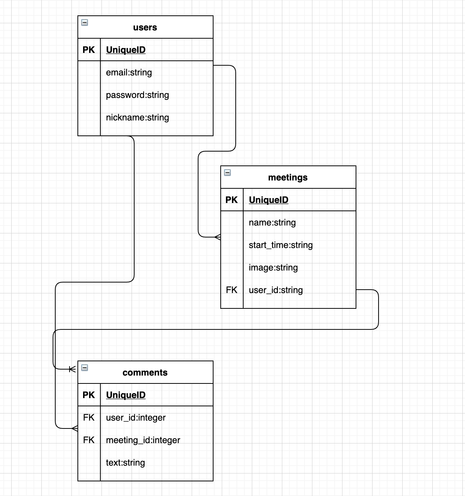

# MANEJA

"MANEJA"は工程管理などに使えるスケージュール管理アプリです。

## 🌐 App URL
https://maneja.herokuapp.com/  
テスト用アカウント  
メールアドレス:  test@test.com  
パスワード: q11111

## :bookmark:Features

- 投稿したスケジュールが"SCHEDULE LIST",カレンダーに反映されます。  

- 画像も投稿でき、ログインしているユーザーは各投稿にコメントすることができます。

## :pencil:Note
- 接続先およびログイン情報については、上記の通りです。
- 投稿方法は以下の手順で確認できます
  テストアカウントでログイン→トップページから"new"ボタン押下→スケジュール入力、画像投稿→登録する
  
## :pill:Requirement
- Ruby/Ruby on Rails/sqlite/Github/Heroku/Visual Studio Code

## 💬 Usage
'$ git clone https://github.com/yusuke0621/calendar.git'

## :ticket:License
- [MIT](https://github.com/yusuke0621/calendar/blob/master/LICENSE)

## :floppy_disk:DB
### meetingsテーブル
|Column|Type|Options|
|------|----|-------|
|name|string|null: false, foreign_key: true|
|image|string||
|user_id|integer|null: false, foreign_key: true|
|start_time|string|null: false
### Association
- belongs_to :user
- has_many :comments

### usersテーブル
|Column|Type|Options|
|------|----|-------|
|email|string|null: false, unique: true|
|password|string|null: false|
|nickname|string|null: false, unique: true|
### Association
- has_many :meetings
- has_many :comments

### commentsテーブル
|Column|Type|Options|
|------|----|-------|
|user_id|integer|null: false, foreign_key: true|
|meeting_id|integer|null: false, foreign_key: true|
|text|string|
### Association
- belongs_to :meeting
- belongs_to :user
